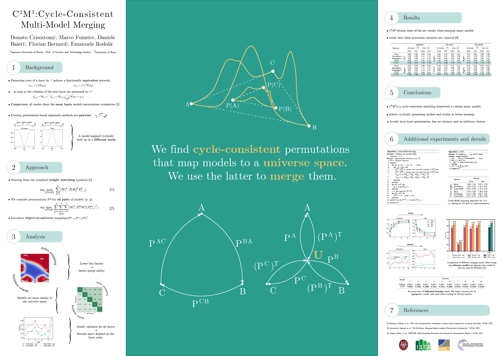
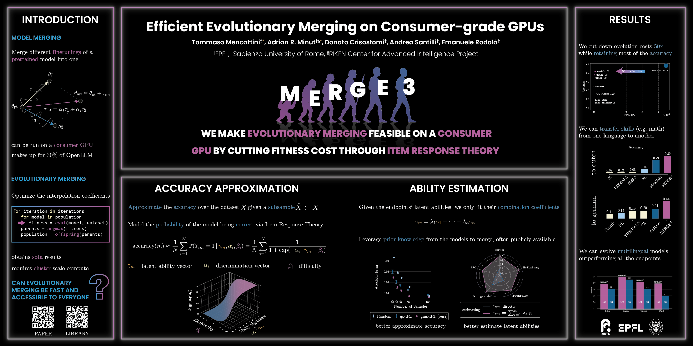

# Posters

This repository temporarily hosts my research posters. Files live under `raw/`.  
Click a poster to view it full size.

## Gallery

   
  <em>Task Singular Vectors: Reducing Task Interference in Model Merging</em> (CVPR 2025) — 
  <a href="https://arxiv.org/abs/2412.00081">arXiv:2412.00081</a>

   
  <em>C2M3: Cycle-Consistent Multi-Model Merging</em> (NeurIPS 2024) — 
  <a href="https://arxiv.org/abs/2405.17897">arXiv:2405.17897</a>

   
  <em>MERGE3: Efficient Evolutionary Merging on Consumer-grade GPUs</em> (ICML 2025) — 
  <a href="https://arxiv.org/abs/2502.10436">arXiv:2502.10436</a>

